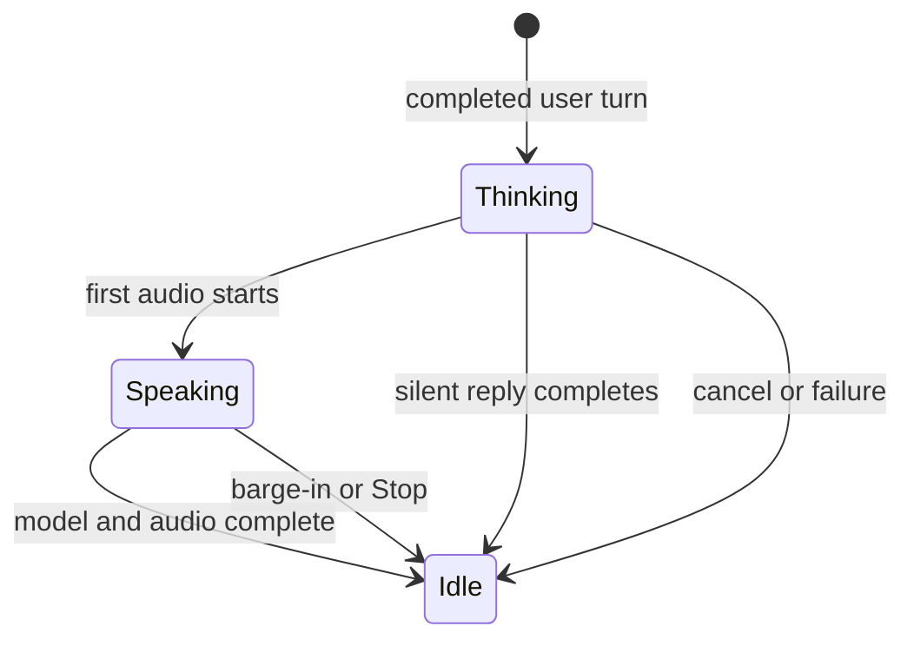
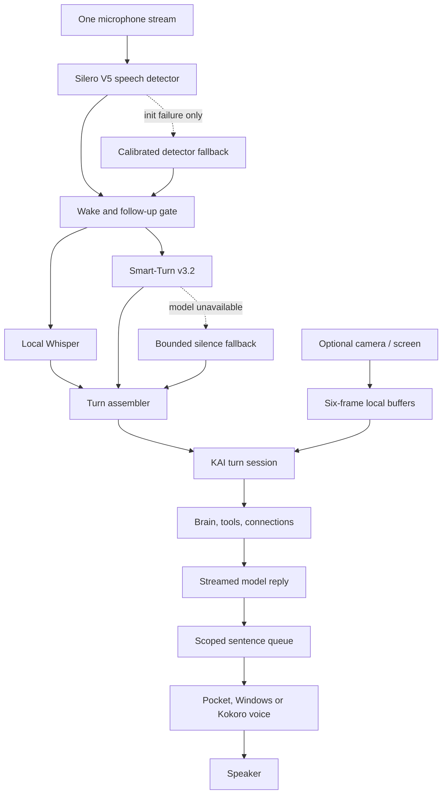

# KAI Live Senses architecture

KAI Live Senses is the boundary between microphones/cameras, the KAI agent, and voice playback. It keeps sensory work local and gives every user request one identity from capture through final audio.

This design is informed by OpenLive's thick-client sensory pipeline, while preserving KAI's wake phrase, 60-second follow-up window, Brain, tools, connected apps, desktop control, local/private/network routing, Pocket voices and approval rules.

## The turn contract

`ui/mascot-live.js` is the authoritative lifecycle for a companion request. A turn owns:

- one monotonic `turnId`;
- one `AbortController` shared by model and tool requests;
- scoped speech synthesis and playback;
- registered cancellation handlers for native/tool work;
- stage watchdogs;
- timing marks with no prompt, output or tool payload content.

The microphone's device state remains separate from the active request. It can be waiting for “Hey KAI,” capturing, transcribing, holding an incomplete thought or paused without inventing a second model turn.

## Required invariants

1. Only the current turn can add model text, synthesized audio or playback.
2. Starting a new turn cancels the prior active turn before assigning the next id.
3. Stop/barge-in aborts fetches, tool actions, synthesis and playback through the same turn.
4. A model-complete turn stays active until its scoped voice queue drains. A speech failure retires speech but preserves the text answer.
5. Late results from a cancelled turn are ignored even when an underlying engine cannot be cancelled immediately.
6. Hiding KAI stops capture and playback. It may let an already approved text action finish, but explicitly retires that turn's voice stage.
7. Diagnostics retain stage names, status and durations only. Conversation text and tool data are not recorded.

`ui/mascot-speech.js` retains a private synthesis epoch as an implementation detail, but its public boundary is now the shared turn scope. That double boundary protects against both a late promise in one queue generation and data accidentally offered by an older KAI turn.

## Current pipeline

`ui/mascot-vad.js` owns this detector boundary. It lazily loads the bundled Silero v5 model and reuses KAI's existing ONNX Runtime with one WASM inference lane. `@ricky0123/vad-web` receives the microphone stream and `AudioContext` KAI already opened, so successful Silero startup creates no second `getUserMedia` request and no second capture worklet. Its output is a bounded 16 kHz speech segment; raw microphone audio still never leaves the computer.

The Voice & listening panel reports both detector stages: **Silero VAD + Smart-Turn v3** when the primary path is active, or the exact calibrated/silence fallback in use. The calibrated detector begins only after Silero initialization fails, so the two capture worklets never run together. Quiet, Everyday room and TV nearby map to Silero probability thresholds. Quick, Natural and Patient now control a cohesive turn policy: trailing silence, Smart-Turn confidence and a 2.5/4/6-second maximum semantic hold. Wake gating, Whisper, echo rejection, follow-up state and guarded “KAI” interruption remain after that boundary.

Core serves six exact, allowlisted local VAD asset routes rather than exposing `node_modules` or a resources directory. Installer builds copy only the VAD bundle, worklet, 2.3 MB Silero model and pinned 8.7 MB Smart-Turn model. Smart-Turn is not browser-addressable: a lazy isolated local worker reuses KAI's existing Transformers.js feature extractor and native ONNX Runtime. This avoids another inference stack, keeps model work off Core's event loop and releases the worker after two idle minutes. The mascot CSP grants `wasm-unsafe-eval` solely for local VAD WASM compilation and does not grant general JavaScript `unsafe-eval`.

Whisper transcribes only the newest speech segment while Smart-Turn analyzes the accumulated current turn in parallel. The renderer retains at most the newest eight seconds of PCM, matching the model's training contract, and sends each audio buffer only to loopback Core. Smart-Turn returns a probability, never a transcript. A low score or narrow trailing-phrase guard holds the assembled question; continued speech reruns the model with updated context. Tap-to-send bypasses the model, a 20-second conversational bound prevents indefinite capture, and inference/model errors immediately preserve the prior silence-only behavior.

The listener passes local capture, transcription and endpoint timing into the KAI turn. The turn then records first model token, first TTS work, first audible playback, model completion and speech completion. `window.kaiLiveDiagnostics.summary()` provides session p50/p95 measurements; `recent()` provides bounded per-turn stage timelines. These are development diagnostics and never include text.

First-response and stream-stall watchdogs recover a turn instead of leaving KAI indefinitely busy. Tool activity refreshes the watchdog. Native approval pauses the watchdog so a person is never timed out while reviewing an action.

## KAI Eyes

`ui/mascot-eyes.js` adds optional screen and camera producers to the same turn boundary. Both sources are off at launch and require a direct session toggle plus a native confirmation bound to the exact selected model. The compact companion keeps an orange capture indicator visible for the entire session. Off, hide, return to the main app, renderer loss, quit or a model change stops capture, releases camera tracks and deletes buffered frames.

Each enabled source samples at about 1 FPS and retains at most six 640-pixel JPEG frames in renderer memory. A completed typed or spoken turn receives only the freshest frame from each enabled source. These content-parts exist only in the model request: the chat store continues to save the user's text and KAI's answer without image data. Cancelled turns reject late capture results through the same turn `AbortSignal` and the source generation guard.

Screen capture stays in Electron's main process. `electron/mascot-eyes.js` selects the display containing KAI, uses a bounded `desktopCapturer` thumbnail and exposes it only through exact companion-window/main-frame/`/mascot.html` IPC. Camera capture uses a video-only `getUserMedia` stream in the sandboxed renderer; it never opens another audio stream. Neither path creates a Core capture route, model tool available to workers, file archive or background sensing service.

Only an installed local vision model or a recognized private OpenAI/Anthropic vision model can receive frames. A source grant records that destination and is revalidated before a turn. Network models and text-only models are refused. Local visual requests set `kai_private_desktop: true`, which is an egress opt-out: Core strips it before local inference and disables both network overflow paths. Private-provider frames use the existing encrypted direct desktop transport, and Local-Only can revoke that route at any time.

When the current 640-pixel frame is insufficient, the private planner can call `kai_look` for one fresh screen or camera image up to 1600 pixels. The action works only for an already enabled source and the same model. It grants no click, typing or desktop-control authority; those remain behind their separate per-task and per-action approvals. High-detail frames are turn-scoped and never enter the rolling buffer, tool observations, diagnostics or chat history.

## Next migrations on this boundary

The turn contract is deliberately independent of a VAD, STT, turn detector or TTS vendor. The next test-only revisions can therefore replace one stage at a time:

1. Move audio output to one gap-free, AEC-visible playback clock after Pocket/Windows/Kokoro parity is verified.

Each migration must preserve Hey KAI, wake-guarded interruption, the shared app profile, Local-Only behavior, model capability checks, visible capture indicators, approval boundaries and packaged Windows verification.

## Verification

- `core/test/mascot-live.test.js` checks shared cancellation, late-event rejection, stage watchdogs, completion barriers and content-free diagnostics.
- `core/test/mascot-speech.test.js` checks that old scoped text and audio cannot cross a turn boundary.
- `core/test/mascot-turns.test.js` checks that listening timing reaches the shared turn.
- `core/test/mascot-vad.test.js` checks one-stream ownership, threshold mapping, pause/flush serialization, 16 kHz handoff and calibrated fallback.
- `core/test/mascot-turn.test.js` checks audio-window ownership, policy thresholds, text guards and silence fallback.
- `core/test/smart-turn.test.js` runs the real pinned Smart-Turn model in the isolated worker and exercises its loopback gateway boundary.
- `core/test/live-senses-assets.test.js` runs the real Silero model with KAI's pinned ONNX Runtime, verifies the Smart-Turn hash and checks exact asset routing. Chromium also compiles the browser runtime/model pair where the CI browser is available.
- `core/test/mascot-eyes.test.js` checks bounded rolling frames, ephemeral high-detail looks, model-bound grants, screen selection, camera cleanup, late-result rejection and local/private/network capability gates.
- Companion/tool/browser checks verify image content-parts, network-overflow opt-out, visible compact capture status, text-only chat persistence and hide cleanup.
- Existing deterministic, browser, native Windows and packaged voice checks remain required.
