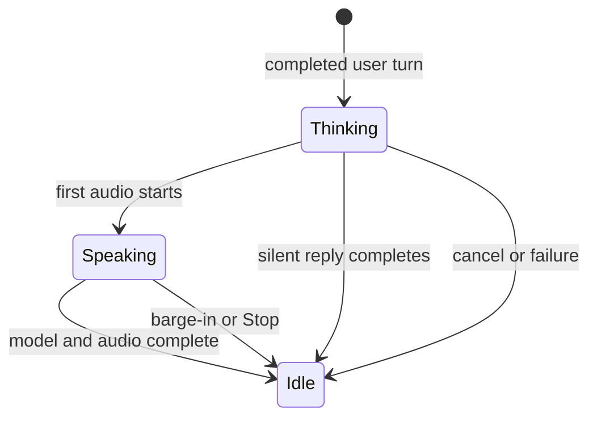
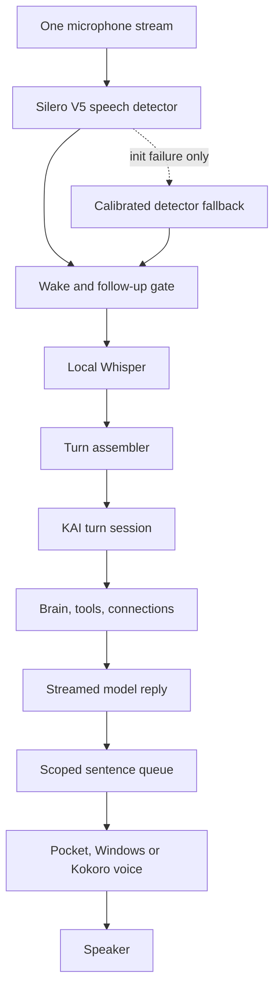

# KAI Live Senses architecture

KAI Live Senses is the boundary between microphones/cameras, the KAI agent, and voice playback. It keeps sensory work local and gives every user request one identity from capture through final audio.

This design is informed by OpenLive's thick-client sensory pipeline, while preserving KAI's wake phrase, 60-second follow-up window, Brain, tools, connected apps, desktop control, local/private/network routing, Pocket voices and approval rules.

## The turn contract

`ui/mascot-live.js` is the authoritative lifecycle for a companion request. A turn owns:

- one monotonic `turnId`;
- one `AbortController` shared by model and tool requests;
- scoped speech synthesis and playback;
- registered cancellation handlers for native/tool work;
- stage watchdogs;
- timing marks with no prompt, output or tool payload content.

The microphone's device state remains separate from the active request. It can be waiting for “Hey KAI,” capturing, transcribing or paused without inventing a second model turn.

## Required invariants

1. Only the current turn can add model text, synthesized audio or playback.
2. Starting a new turn cancels the prior active turn before assigning the next id.
3. Stop/barge-in aborts fetches, tool actions, synthesis and playback through the same turn.
4. A model-complete turn stays active until its scoped voice queue drains. A speech failure retires speech but preserves the text answer.
5. Late results from a cancelled turn are ignored even when an underlying engine cannot be cancelled immediately.
6. Hiding KAI stops capture and playback. It may let an already approved text action finish, but explicitly retires that turn's voice stage.
7. Diagnostics retain stage names, status and durations only. Conversation text and tool data are not recorded.

`ui/mascot-speech.js` retains a private synthesis epoch as an implementation detail, but its public boundary is now the shared turn scope. That double boundary protects against both a late promise in one queue generation and data accidentally offered by an older KAI turn.

## Current pipeline

`ui/mascot-vad.js` owns this detector boundary. It lazily loads the bundled Silero v5 model and reuses KAI's existing ONNX Runtime with one WASM inference lane. `@ricky0123/vad-web` receives the microphone stream and `AudioContext` KAI already opened, so successful Silero startup creates no second `getUserMedia` request and no second capture worklet. Its output is a bounded 16 kHz speech segment; raw microphone audio still never leaves the computer.

The Voice & listening panel reports either **Silero VAD · local speech detection active** or the calibrated compatibility fallback. The fallback begins only after Silero initialization fails, so the two worklets never run together. Quiet, Everyday room and TV nearby now map to Silero probability thresholds, while Quick, Natural and Patient retain their existing trailing-pause behavior. Wake gating, Whisper, echo rejection, follow-up state and guarded “KAI” interruption still run after that boundary and are unchanged.

Core serves six exact, allowlisted local asset routes rather than exposing `node_modules` or a resources directory. Installer builds copy only the VAD bundle, worklet and 2.3 MB model; they reuse the ONNX Runtime already packaged for KAI's speech systems instead of shipping vad-web's second runtime. The mascot CSP grants `wasm-unsafe-eval` solely for local WASM compilation and does not grant general JavaScript `unsafe-eval`.

The listener passes local capture, transcription and endpoint timing into the KAI turn. The turn then records first model token, first TTS work, first audible playback, model completion and speech completion. `window.kaiLiveDiagnostics.summary()` provides session p50/p95 measurements; `recent()` provides bounded per-turn stage timelines. These are development diagnostics and never include text.

First-response and stream-stall watchdogs recover a turn instead of leaving KAI indefinitely busy. Tool activity refreshes the watchdog. Native approval pauses the watchdog so a person is never timed out while reviewing an action.

## Next migrations on this boundary

The turn contract is deliberately independent of a VAD, STT, turn detector or TTS vendor. The next test-only revisions can therefore replace one stage at a time:

1. Add local Smart-Turn after Whisper for `finished / continuing`, with manual Send and the bounded silence policy as fallbacks.
2. Add KAI Eyes as optional camera and screen producers. Keep a small low-resolution rolling buffer and attach only the freshest approved frame to the current turn; use a separate high-resolution `look` action when necessary.
3. Move audio output to one gap-free, AEC-visible playback clock after Pocket/Windows/Kokoro parity is verified.

Each migration must preserve Hey KAI, wake-guarded interruption, the shared app profile, Local-Only behavior, model capability checks, visible capture indicators, approval boundaries and packaged Windows verification.

## Verification

- `core/test/mascot-live.test.js` checks shared cancellation, late-event rejection, stage watchdogs, completion barriers and content-free diagnostics.
- `core/test/mascot-speech.test.js` checks that old scoped text and audio cannot cross a turn boundary.
- `core/test/mascot-turns.test.js` checks that listening timing reaches the shared turn.
- `core/test/mascot-vad.test.js` checks one-stream ownership, threshold mapping, pause/flush serialization, 16 kHz handoff and calibrated fallback.
- `core/test/live-senses-assets.test.js` runs the real Silero model with KAI's pinned ONNX Runtime and checks exact asset routing. Chromium also compiles the browser runtime/model pair where the CI browser is available.
- Existing deterministic, browser, native Windows and packaged voice checks remain required.
