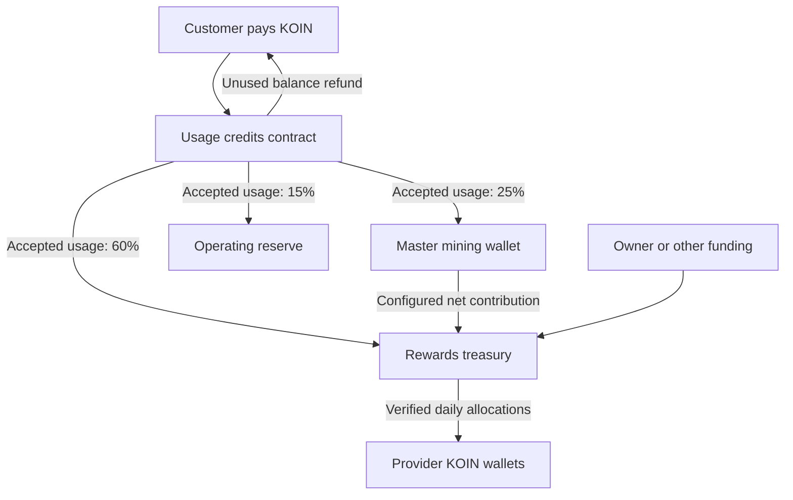

# KAI — KOIN payments, network rewards and Earn

**Implementation specification v1.0 — September 24, 2026, America/Chicago**  
Prepared after the owner's decisions on master-node verification, KOIN settlement, treasury funding and owner control. Simulations executed September 25 UTC. This records the approved build baseline before implementation. See STATUS.md for the current implementation and outstanding activation gates.

## 1. Decisions and recommended launch settings

KOIN becomes the currency for purchasing network usage and receiving network rewards. KAI remains the assistant/product name. Usage credits are an account record, with no separate tradeable token. Local inference remains free of network usage charges.

The master node's existing reburn, retained-wallet and distribution settings are already satisfactory according to the owner. This design takes its configured contribution as **net incoming funding**, without changing those settings or forecasting additional mining returns. Its reward-distribution destination will eventually become the rewards treasury contract.

| Item | Build baseline | Reason/status |
|---|---|---|
| Reward asset | Native mainnet KOIN | Owner decision; test deployments use a clearly marked test asset |
| Initial rewards funding | 1,000 KOIN | Owner's intended funding; no transfer authorized or executed by this document |
| Daily reward budget | Up to 5% of free, uncommitted reward KOIN | Owner preference retained; a budget ceiling, not a fixed daily amount |
| Availability / completed work | 70% / 30% | Recommended initial balance; comparisons below |
| Earned usage revenue | 60% reward treasury / 25% mining / 15% operating reserve | Recommended launch policy, adjustable by owner |
| Purchase timing | Hold payment against unused credits; split as accepted usage consumes them | Protects prepaid obligations and supports refunds |
| Work payout ceiling | 80% of that provider's eligible, actually charged KOIN, also limited by its proportional work allocation | Limits simple purchased self-work farming; no fixed per-job payout promise |
| Unused allocations | Return to free rewards treasury | No forced distribution or same-day transfer between reward categories |
| Presence samples | 60-second accounting intervals; 15-minute sealed telemetry batches | Off-chain measurement; no transaction per minute or generated token |
| Reward settlement | Daily root after the reward day ends, with a 24-hour review hold | Automatic sponsored claims after finalization; daily contributions are not immediately spendable |
| Trust adjustment | 0.90 to 1.00; new qualified providers start at 0.95 | Reliability matters without a large incumbent advantage |
| Scarcity adjustment | 0.75 to 1.50, only for approved useful model families | Bounded coverage incentive |
| Mainnet monetary governance | Owner-held administrative keys; separate restricted service keys | Owner decision; future DAO transfer supported, DAO voting design deferred |
| Legacy test KAI | Historical record only; no automatic redemption or conversion | Owner may make a separate snapshot distribution later |
| Earn screen | KOIN earnings and wallet, with usage credits clearly separate | Owner decision |

These are **chosen launch defaults supported by sensitivity analysis**, not mathematically optimal prices or a forecast of provider profitability. Actual paid demand, hardware costs, operating bills and current master-node receipts were not measured in this exercise. The reported roughly 50 KOIN/day contribution is a scenario assumption supplied by the owner.

## 2. Simulation method and findings

The accompanying reproducible Python program uses only the standard library. It explores **1,500 combinations over 180 days each**, plus a 180-day verifier-outage case: **270,180 treasury-day calculations**. Separate calculations cover provider fairness, prepaid liabilities, node-count dilution and self-work incentives. Inputs and full results are included in the simulation archive.

The grid combines five funding splits, three daily budget rates (2%, 3%, 5%), four availability allocations (50%, 60%, 70%, 80%), and 25 funding/demand scenarios. Constant net master funding is 0, 25, 50 or 100 KOIN/day; consumed paid usage is 0, 5, 25, 100 or 500 KOIN/day. Stress cases include interrupted and permanently lost mining contributions, a demand spike, gradual growth and variable daily inflows. These scenarios have **no assigned probabilities**.

Each day starts with free rewards balance B. The simulator sets budget D = rate × B, pays eligible availability up to a × D, and pays work up to min((1−a) × D, 0.80 × consumed paid revenue). It then adds net master funding and the rewards share of consumed revenue. Mining and operating allocations are recorded separately. The work calculation is an aggregate upper bound: individual provider caps can reduce actual payouts further.

All prepaid customer funds and already committed but unclaimed payouts are outside B. The simulated rewards balance falls when a payout becomes owed, regardless of when someone claims it. New inflows in these examples enter after the opening snapshot. Calculations use floating point for exploration; implementation must use checked integer arithmetic in KOIN atoms.

### 2.1 Results with the recommended defaults

| Scenario | Day 1 actual payout | Day 30 payout | Day 180 payout | Free reward balance at day 180 |
|---|---:|---:|---:|---:|
| Master 50/day; no paid usage | 35.00 | 44.66 | 49.97 | 1,427.87 |
| Master 50/day; consumed usage 5/day | 39.00 | 48.02 | 52.98 | 1,399.34 |
| Master 50/day; consumed usage 25/day | 50.00 | 61.61 | 65.00 | 1,299.97 |
| Master 50/day; consumed usage 100/day | 50.00 | 96.44 | 109.99 | 2,199.88 |
| No master funding and no paid usage | 35.00 | 12.46 | 0.06 | 1.64 |
| Master stops after day 30; consumed usage remains 25/day | 50.00 | 61.61 | 15.02 | 300.43 |

At zero jobs, only the 70% availability allocation is paid: 3.5% of free balance on the first day, or 35 KOIN from a 1,000 KOIN seed. With sustained 50/day funding, the free pool tends toward 50/0.035 = 1,428.57 KOIN and availability payments toward 50/day. **We should not advertise 50 KOIN on day one unless sufficient eligible work also exists.**

With enough paid work to use both allocations, long-run payouts track incoming funding. For example, 50/day master funding plus 60% of 100/day consumed revenue gives about 110/day. That is a funding identity, not a mining-yield or adoption prediction.

In the 30-day mining interruption, with 25/day consumed usage continuing, the free reward pool falls to approximately **511.67 KOIN**, and day-90 payout to **26.14 KOIN**. It then recovers after funding resumes. The percentage rule remains solvent by reducing rewards; it cannot guarantee attractive earnings or continued provider participation.

### 2.2 Why 60/25/15 instead of 50/50

The following comparison assumes 50/day net master funding and 100/day consumed paid usage for 180 days, with sufficient eligible work:

| Reward / mining / operations | Day-180 payout | Mining allocation over 180 days | Operating allocation over 180 days |
|---|---:|---:|---:|
| 50 / 50 / 0 | 99.99 | 9,000 | 0 |
| 50 / 30 / 20 | 99.99 | 5,400 | 3,600 |
| **60 / 25 / 15** | **109.99** | **4,500** | **2,700** |
| 70 / 20 / 10 | 119.99 | 3,600 | 1,800 |
| 80 / 10 / 10 | 129.99 | 1,800 | 1,800 |

No row dominates every objective. Increasing current rewards reduces mining or operating funding. The recommendation deliberately retains a quarter of earned usage revenue for reinvestment and creates an explicit operating allocation, while directing a majority to providers. Those are policy choices, not measured optimal cost shares.

The simulator credits **no future return** on the mining allocation. It therefore cannot prove that 25% beats 50% over the long term. That comparison needs measured net marginal mining returns and a chosen investment horizon.

The 15% operating allocation is also not proof that costs are covered. It funds 3.75 KOIN/day at 25/day consumed revenue, or 15/day at 100/day. An assumed 5 KOIN/day operating bill needs 33.33 KOIN/day consumed revenue; a 10/day bill needs 66.67/day. Before that, the owner needs to cover the difference separately. The 1,000 KOIN seed remains dedicated to rewards unless the owner later explicitly changes that allocation.

### 2.3 Why retain the 5% maximum

With master funding 50/day and consumed revenue 25/day, both 2%, 3% and 5% eventually approach the same funding-supported payout of 65/day. A lower percentage builds a larger reserve and reacts more slowly. At day 180, 2% gives approximately 63.79/day with a 3,190.72 KOIN pool; 5% gives 65/day with a 1,299.97 KOIN pool.

5% matches the owner's intended launch budget. It also means the reserve falls quickly during funding interruptions. Keep it adjustable, show net inflows and free balance in the admin dashboard, and simulate a proposed change before scheduling it. Do not silently increase the percentage to preserve a fixed payout when funding falls.

### 2.4 Why 70/30 availability/work

This illustrative network has a 4B node always ready, an 8B node doing 70% of weighted paid work, a needed 14B specialist doing 15%, and an 8B node online eight hours doing 10%. The 4B node does the remaining 5%. Reliability multipliers differ slightly, and the specialist has a deliberately assumed 1.5 coverage multiplier. The 50 KOIN budget is fully eligible; work caps do not bind.

| Availability / work | 4B ready | 8B busy generalist | 14B needed specialist | 8B intermittent |
|---|---:|---:|---:|---:|
| 50 / 50 | 5.59 | 23.90 | 16.32 | 4.19 |
| 60 / 40 | 6.21 | 21.68 | 18.08 | 4.03 |
| **70 / 30** | **6.83** | **19.46** | **19.84** | **3.87** |
| 80 / 20 | 7.45 | 17.24 | 21.61 | 3.71 |

70/30 approximately balances the busy generalist and the needed specialist **in this constructed example**. It is not a universal fairness result. It matches the owner's preference to reward availability strongly while giving delivered work a substantial separate influence. Model-size exponents of 0.5, 0.75 and 1.0 are also included in the results; 0.5 moderates domination by headline model size.

### 2.5 Abuse and customer-fund examples

With an uncapped 15 KOIN work allocation and no competing jobs, 1 KOIN of manufactured self-work could capture 15 KOIN. An 80% actual-charge cap limits that work reward to 0.8 KOIN, a 0.2 KOIN loss before compute costs. A 100% cap leaves no monetary loss before compute costs; 50% is more restrictive for legitimate providers. 80% is the selected initial compromise.

The simulator also compares 180 days of repeated self-work against the same provider doing no self-work. For daily spend of 1, 5, 25 and 100 KOIN and fixed availability shares of 0%, 10%, 50% and 100%, all tested cumulative incremental returns remain negative under the recommended policy. This is a narrow incentive check, **not a proof against collusion, false measurements, manipulation of capacity, or compromised service keys**.

For a prepaid-liability illustration, isolate a 1,000 KOIN customer purchase with no usage, no seed and no later funding. An immediate 50/50 split sends 500 to mining and leaves 500 in rewards. Paying availability at 3.5% daily leaves about 20.25 of that reward cash after 90 days. Holding the unused purchase in the credits contract leaves all 1,000 available. This is why revenue should be allocated when service is consumed.

A fixed 50 KOIN reward pool shared equally gives 5 KOIN each to 10 providers, 0.5 each to 100, and 0.1 each to 500. Supply growth does not itself create more funding. This model needs useful demand and sufficient incoming KOIN; these simulations do not establish provider break-even.

## 3. Money flow and contract boundaries

Two new contracts are sufficient for this phase. The future agent-rental escrow remains separate because acceptance, creator payments and disputes have different obligations. Existing agent-network contract code can be evaluated for that future phase; it is not treated as already deployed paid infrastructure.

The 25% mining allocation must be tracked as **new mining capital**. Sending KOIN to the master wallet does not itself create VHP. The inspected ordinary reward-return code explicitly distinguishes earned block rewards from deposits, so its reburn percentage must not be assumed to burn this new incoming capital automatically. During integration, verify the master branch's behavior and add an explicit, owner-authorized purchase-funded Proof-of-Burn route if needed. Keep its existing earned-reward reburn and retained-wallet policy unchanged. Record the matching VHP receipt and producing account; a generic permanent token burn is not a substitute. The simulations count the allocation as transferred capital and assume neither an executed burn nor future income from it.

### Usage credits contract

Store account balances, reservations, session grants, approved tariff versions and unique settlement identifiers. Customer payments are held as native KOIN. Credits are a non-transferable service-account record; there is no mintable KAI token or exchange listing.

For v1, store service credit value in KOIN atoms. One KOIN of deposited value backs one KOIN of service credit value. UI may present this as “Usage credit” with an estimated token allowance for the selected model. Input/output token counts remain the metering units; a balance is not a guarantee of the same token count across models. Dollar equivalents are display estimates only. USD purchases and a live conversion oracle are deferred.

Use an explicit purchase entry point so the payment, beneficiary and credit entry are tied together. A raw KOIN transfer alone must not silently manufacture credits. Finalized payment is required before spendable credit appears.

Reserve a bounded amount before dispatching work. Session grants authorize a specific verifier, expiry, models/tariff versions, per-job ceiling, total spending limit and maximum outstanding reservations. The master must atomically allocate session capacity across concurrent requests so one balance cannot fund several jobs beyond its limit. Chain reservations provide the outer bound; the master keeps a durable job ledger inside that bound.

Settle actual authorized usage in batches, proposed at 15-minute intervals. Every job ID is settled once. The receipt commits buyer, worker, model hash, tariff version, request authorization, metered usage, charge, timestamps and result commitment. The charged amount cannot exceed the reservation or quote. Release unused reserved value. Failed or unverifiable jobs do not charge; interrupted streaming only charges delivered accepted usage if the quoted policy explicitly permits it. Maintain on-chain settled-charge totals per provider and reward day, so a reward claim's 80% limit can be checked against real charged funds. A job whose charge is not finalized before that day's root is sealed moves to the next open work-reward period, once; it is not appended to a finalized root. Availability remains attributed to when service occurred.

Apply the 60/25/15 split to the **actual charge**, with integer rounding residues retained and reconciled. An unsettled reservation is not revenue. On-chain transfer failures must leave the charge unapplied or leave a precisely recorded, fully backed destination liability; never half-complete a purchase or settlement.

Unused, unreserved credit is refundable in its remaining KOIN principal value. A grant uses a 24-hour inactivity/settlement deadline as the initial build default: revoked grants accept no new jobs, and after the deadline without valid settlement the unspent reservation becomes releasable. A restarted or offline master cannot hold customer funds indefinitely. Final implementation must bind late-settlement rejection to the same deadline and nonce so refund and settlement cannot both succeed. Paid credits do not expire in v1; bonus credits, if introduced, must be explicitly distinct.

This backed-ledger design leaves an ongoing obligation to provide useful service, even though unused principal remains available. Model prices are pinned to each accepted quote; future tariff changes do not rewrite accepted work.

### Rewards treasury contract

Receive seed funds, donations, the configured master contribution and 60% of finalized usage charges. Receiving ordinary treasury funding creates no customer credit.

Maintain free reward funds, open-day reserved budgets, pending-root obligations, final unclaimed obligations and total paid amounts. **Free funds = accounted liquid KOIN less every outstanding reservation and claim liability.** Customer funds live in the other contract; operating and mining allocations are not free reward funds.

Use native KOIN transfers for claims. Do not reuse the test-token mint operation with a renamed symbol. No unbacked rewards, credit against estimated future mining, or ability to spend estimated earnings before a claim is final and funded.

Any caller may relay a valid claim, but payment always goes to the leaf's committed provider address. The master will sponsor automatic claims as the default payout experience, as confirmed by the owner. Providers should not need to click Claim or sign each reward payment; a manual claim remains a recovery option. A failed claim transaction leaves the same entitlement available for retry. Claimed state and transfer success must commit atomically. Claims have no short forfeiture timer in v1; their reserves remain excluded until paid.

Owner withdrawals from this contract may use free, uncommitted funds only. Standard administrative functions cannot withdraw customer or claim liabilities. Because the owner retains upgrade authority, these are guarantees of the deployed code under the declared governance model, not protection against every possible owner-installed replacement.

### Operating reserve

Use a designated owner-controlled account, visibly separate from reward funds. The 15% allocation can fund hosting, verification, support, development, sponsored Mana and other approved operating costs. It is not an automatic profit distribution. Unspent operating money stays there; it does not automatically return to the daily reward base. Its actual expenses and any owner top-ups should be tracked.

Koinos execution consumes Mana and has compute, network and storage limits. Use a separate, funded sponsorship account in v1, bounded batches and per-provider claims; do not routinely consume customer-custody Mana and impair refund liquidity. Load-test real Mana use rather than assuming 1,000 KOIN in reward custody will also support arbitrary transaction volume. [Koinos resource management](https://docs.koinos.io/developers/resource-management/) and [Mana](https://docs.koinos.io/overview/mana/).

## 4. Reward calculation

### 4.1 Daily budget and timing

Use UTC reward-day IDs; display the user's local settlement time in the app. `open_epoch` fixes that day's free-balance snapshot, settings version and budget once. A master keeper normally opens the period at its start. The contract uses chain time and rejects duplicate or future epochs.

If opening occurs late, eligible contribution starts at the actual opening time and the 5% ceiling is prorated to the remaining fraction of that UTC day. Do not retroactively create full daily budgets for missed days. Deposits after the opening snapshot enter a later budget. This removes any need to reconstruct a historical raw token balance when the keeper was offline. A master outage may delay or reduce rewards; show this instead of inventing continuity.

At close, calculate availability and work allocations, reserve the committed total, and release the unused portion. Publish a complete allocation manifest and its commitment. Hold the proposed root for 24 hours for automated reconciliation and owner review. It is not an independent fraud-proof or decentralized challenge system. The owner may cancel a bad pending root; finalized roots cannot be edited. A corrected pending root restarts the hold. Publication alone is not a paid wallet balance.

Submit roots in sequence, once per day, and prevent skipped-day budget creation, duplicate claims, cross-chain replay, and cross-contract replay. A configurable keeper retries idempotently. If evidence is unavailable, retain funds and mark the affected interval unsettled or ineligible; never guess scores.

### 4.2 Availability points

Pay for usable service capacity that is actually committed to the network. V1 measures **execution slots**, not files downloaded or model names advertised. Each slot is credited for the model it is currently ready to serve, including time working on valid assigned jobs. A switch earns nothing for the new model until it is ready. An idle downloaded alternative does not receive simultaneous credit.

A provider may earn for a 4B and an 8B model concurrently if a simultaneous benchmark shows both meet their service requirements. Otherwise, a shared slot accrues whichever model it actually serves over time. Faster service and more accepted jobs also earn through the work allocation. Multi-slot claims need concurrent validation; self-reported RAM, GPU names, or wallet count do not establish independent capacity.

For each eligible minute and slot, use:

`slot score = published model weight × coverage multiplier × reliability multiplier`

The initial size component is `sqrt(dense parameters / 4 billion)`. Published registry values are rounded fixed-point integers, not contract floating-point calculations. Illustrative values: 4B = 1.0000, 8B = 1.4142, 14B = 1.8708, 32B = 2.8284. This keeps model size meaningful while reducing the incentive to select a huge model solely for its parameter count. Only approved useful models with completed benchmarks receive a positive weight. Mixture-of-experts, image/audio models and other architectures need explicit calibrated entries; headline parameter count alone cannot assign them an automatic tier.

For interval t:

`provider availability reward = interval budget × provider score(t) / total eligible score(t)`

The interval budget is the availability day's allocation times the interval's fraction of eligible day duration. Sum across intervals. If the denominator is zero, retain that interval's money. **Do not divide summed node-hours by summed whole-network hours at the end**: that can pay the wrong share when network supply changes. Example: 12/24 for half a day and 12/120 for half a day produces 30%, not the ratio of whole-day parameter totals.

Coverage is grouped by canonical model family and service tier, so aliases, quantizations or copies do not create artificial rarity. Each approved family gets a published target count of independently verified ready slots. Initial coverage multiplier proposal: `clamp(sqrt(target / max(1, observed_supply)), 0.75, 1.50)`, using trailing 24-hour average qualified supply, fixed for the next reward day. Limit normal day-to-day multiplier changes to 10%. Initial target is two qualified slots for a newly approved needed family; the owner can adjust targets prospectively based on demand and redundancy. This smooths manipulation and discourages repeated switching. The current interval's network denominator still changes as nodes join and leave.

These targets and weights express owner policy until decentralized governance exists. Unknown/private models, duplicate aliases and unsupported tiers earn no availability credit. “Rare” alone does not make a model useful.

### 4.3 Uptime and reliability

Count verified eligible seconds/minutes directly. There is no separate payment merely for having an old account, and no historical reward while offline. A deliberate pause stops availability accrual without being labeled dishonesty. Nodes serving an assigned job remain eligible; probes must not punish them for being busy on that job.

The initial trust policy uses a seven-day-half-life weighted success rate from challenges and accepted assignments. Initialize a prior of five success-equivalent and five failure-equivalent observations, so a newly admitted node starts at 0.95. At time t, `success_rate = (5 + decayed_successes) / (10 + decayed_successes + decayed_failures)` and `reliability = 0.90 + 0.10 × success_rate`. There is no separate tenure bonus. Current qualification is independent of that modest multiplier: failed service checks stop credit until a fresh verification succeeds. No assigned jobs is not a failure. A system-wide verifier outage is not a provider reliability failure. The illustrative provider simulation varies reliability values directly rather than pretending to model real seven-day histories.

Signed presence heartbeats prove only that a key responded. Require admission benchmarks, unpredictable service challenges, verifier-observed timings and concurrency checks. Select ongoing checks without making readiness predictable solely from the heartbeat schedule. Pin model package hashes and tokenizers. These measures improve confidence but are not cryptographic proof that a particular GPU or exact model was used. Multiple identities and remote forwarding remain adversarial cases for the centralized verifier to detect and limit; IP address alone is not a hardware identity.

### 4.4 Completed work

For each accepted paid job, calculate weighted work from its verified input and output token counts using the accepted model tariff. Define points in the tariff's normalized KOIN charge units. Thus an expensive, approved model can earn more points for the same token count, without multiplying by model size again after pricing it. All rates and units are pinned in the quote and receipt.

For provider i:

`proportional work = work budget × provider paid-work points / total paid-work points`

`work reward = min(proportional work, 80% × provider eligible actual paid charges)`

Do not redistribute capped leftovers in the same day. Retain them in the treasury. The cap binds to actual customer KOIN charged after discounts and pre-finalization adjustments; artificial list prices cannot inflate it. The treasury claim path checks the per-provider cap against the credits contract's finalized charge totals for the committed period. An uncharged, failed, replayed, invalid or self-assigned job does not create paid-work points. Post-finalization goodwill refunds must be separate owner-funded expenses, with abuse monitoring; they cannot recycle the same charged amount into a second work entitlement.

Ordinary free-tier use and verification probes earn no separate cash work reward in v1. They can establish availability/reliability, and a provider's network-serving time remains eligible for availability. Any future sponsored paid workload must have a real, separately funded budget and an identified sponsor; it must not silently turn an unlimited free tier into cash rewards. Bound free service globally as well as per account; address creation does not enlarge the network budget.

The master must meter or reconstruct usage with pinned model tokenization and its observed request/result stream. Provider-reported usage alone is inadequate for mainnet payments. Require quote-consistent limits, finality-aware credit deductions, unique jobs and signed receipts bound to chain/contract/protocol domain. Random model challenges and output-quality checks complement metering; a signature authenticates a report, not its truth. Raw chat prompts and outputs must not be published on-chain or in reward manifests.

## 5. On-chain enforcement and off-chain trust

The owner explicitly accepts the master as the initial verifier and coordinator. Blockchain nodes enforce balances, permissions, commitments and payout limits. The master measures off-chain AI service and determines the input scores. A malicious verifier can misattribute a permitted budget; the contract alone cannot recognize a fabricated model response.

Use a Merkle-sum commitment, or an equivalently bounded allocation structure, committing each provider's availability amount and work amount plus aggregate sums. A plain hash root and an unrelated claimed total are insufficient: otherwise a root could contain claims exceeding its reserved amount and make claim order determine who gets paid. Require root sums to equal the reserved category totals and remain within each category's budget. Publish the canonical, address-sorted allocation list with unique provider addresses. Proofs include authenticated sibling sums, bounded depth, checked arithmetic and domain separation by chain, contract, schema, day, settings version, address and both amounts.

The tree constrains total money and proves membership. It does not prove accurate measurements or the absence of off-chain manipulation. Duplicate/canonicalization rules must be tested; claims are keyed once per day and payout address, and default entries are never treated as valid.

The current Koinos contract model supports calls between contracts and requires a transaction for writes. A keeper triggers opening, settlement, root finalization and sponsored claims; the contract does not autonomously poll nodes or wake up on a timer. [Koinos contract architecture](https://docs.koinos.io/architecture/smart-contracts/).

Maintain separate permissions:

| Role | Allowed | Not allowed through this role |
|---|---|---|
| Owner admin | Schedule parameters, set destinations, replace verifier, pause affected functions, upgrade, transfer administration | Routine functions cannot consume reserved customer/claim funds |
| Master verifier | Submit bounded, versioned usage settlements and daily reward commitments | Upgrade, alter percentages, choose arbitrary treasury withdrawals |
| Keeper / claim sponsor | Relay deterministic calls and valid provider claims | Redirect a claim or change earned amounts |
| Customer | Purchase, authorize bounded sessions, revoke grants, recover unspent funds | Spend another account's credits |
| Provider | Register proof of identity/capacity and receive/claim committed earnings | Self-declare binding reward amounts |

All initial authorities may be controlled by the owner, but keep the high-privilege admin key separate from the online verifier key. Record every monetary-policy change. Normal percentage, destination and tariff changes take effect after a **48-hour notice** and at the next reward-day boundary; never rewrite finalized epochs or existing customer quotes. Emergency pause is immediate and narrowly scoped; refunds and already finalized claims should remain usable unless their own path is affected by the incident. Key rotation uses an explicit logged procedure.

Owner-held upgrade authority and centralized verification must be disclosed plainly. Administration can later transfer to a DAO-controlled account or contract. No DAO membership token, voting allocation or governance currency is selected in this phase. KOIN use does not itself decide who should vote.

## 6. Pricing and service qualification

The monetary plumbing and accounting units are fixed by this plan. **Exact KOIN-per-million-input/output prices and model service thresholds still need measurements during implementation.** Choosing them from treasury percentages alone would invent economics. Paid mainnet purchase must remain disabled until a versioned tariff and service benchmark exist for every offered model.

For each initial model/tier, measure warm and cold first-token latency, sustained output rate, representative input/context costs, successful-request rate and simultaneous service capacity. Include CPU providers and common GPU classes. Calibrate the registry and admission thresholds against those results. Existing August alpha performance notes are historical context, not current capacity measurements.

Publish tariffs in KOIN, show a maximum charge before dispatch, and settle actual verified usage. The quote must identify model/tier, input estimate, output ceiling, tariff version, expiry, maximum KOIN, cancellation policy and available balance. Quotes expire for new dispatch after five minutes; accepted reservations preserve their quoted rates until completion/deadline. Do not silently price an unconfigured model using another model's fallback rate.

Monitor provider costs and acceptance rates against total rewards, including availability. This shared-pool model provides a variable reward, not a guaranteed per-job wage. If providers decline paid demand because payouts do not cover service, the remedy may require tariff changes, more funding, capacity limits or an explicitly priced direct-work market. Percentages alone cannot solve missing demand or make unprofitable work attractive.

Model/creator royalties, if applicable, must be explicit quote line items before the 60/25/15 network-revenue allocation. For v1, offer only models with zero required network royalty under the approved catalog, or define an explicit royalty line before enabling them. Future agent rental quotes must separately show creator/operator compensation, network compute usage and any platform fee; the entire rental price cannot simply enter the ordinary compute split.

## 7. Earn and wallet experience

Make Earn a dedicated KOIN earning and wallet destination. Keep the existing wallet identity and signing controls. Do not create a replacement wallet, merge blockchain networks, or make KOIN spendable merely by renaming old test balances.

The top of the screen should show **wallet KOIN** with an optional fresh USD estimate, **claimable KOIN**, and **estimated current-day rewards** as distinct amounts. An unavailable price should show no estimate, not zero dollars. Do not add those amounts together into one spendable balance. Provide Receive and Send actions using existing wallet approval flows. Automatic sponsored claims deliver to the committed provider address without a user signature for each payment. Keep Claim available as a manual recovery option.

Show availability and completed-work earnings separately, with the model/slot being credited, qualifying uptime, reliability/coverage adjustments, accepted paid jobs and weighted usage. Explain non-earning states: paused by user, model loading, failed qualification, no verified capacity, verifier unavailable, or empty reward pool. A machine busy on a valid network job should not look offline.

Usage credits belong in a separate panel: prepaid value, reserved value, available value, Buy usage and Refund unused credit. Buying usage is an explicit KOIN transaction. Earned KOIN remains in the wallet until the user elects to fund credits. Historical test KAI goes under legacy activity and is never displayed as mainnet KOIN.

Daily activity should distinguish estimated, submitted, under review, claimable, paid and failed/retrying. Show the actual next expected settlement/claim time and the funding pool's current size. No fixed return promises, automatic investment language or fabricated “earned” amount while the verifier is unavailable.

All new strings follow the existing language system. Preserve accessibility, wallet external-signing workflows, local-only mode and the current privacy boundary: network workers never gain access to private Brain data, app credentials, desktop controls or wallet-spending tools.

## 8. Integration map from inspected code

Inspected baseline: `therexdev/kaiapp`, local commit `ff7947f3bf353946af3258b2ac92fa96bab6c17c` (the last Test work in this conversation). No assertion is made here about subsequently changed remote deployments.

| Existing area | Required change |
|---|---|
| `contracts/kai/assembly/Kai.ts` | Historical test-token mint/deposit contract; build new KOIN custody/credits contracts instead of relabeling its mint path |
| `server/scheduler.js` | Add versioned contribution ledger, verified readiness, independent metering, bounded usage sessions and daily two-category scoring |
| `server/chain.js` | Replace testnet-default settlement assumptions with explicit deployment manifests, asset/network checks, finality and funded KOIN claims |
| `core/lib/worker.js` | Prove ready model/slot capacity and sign domain-bound receipts; current reported usage/performance must not be authoritative by itself |
| `core/server.js`, `ui/app.js`, app tools and localization | Separate KOIN wallet, estimates, claims, legacy history and usage credits |
| `core/lib/koinos/rewards.js` and master distribution UI | Verify outgoing treasury destination and separately track/burn incoming purchase-funded mining capital; preserve existing earned-reward reburn/retained-wallet policy |
| `contracts/agent-network`, `core/lib/agent-network` | Keep future rental settlement isolated; paid desktop flows are presently gated in inspected code |

Historical repository economics documents describe earlier KAI bootstrap proposals and some different “implemented” behavior. They must not override current code or this new owner-directed KOIN policy. Inspect the actual deployed scheduler configuration before activation. Remove old KAI oracle conversion, mint subsidy and spend-from-pending-earnings paths from the KOIN flow; preserve legacy reads where useful.

Test installers share live profile/network facilities according to repository instructions. A Test release is **not** blockchain testnet isolation. New settlement defaults must remain read-only/shadow until the explicit signed deployment manifest and rollout mode enable payments. Back up profile/config before schema migration and keep wallet secrets/signing permissions unchanged.

## 9. Build sequence and acceptance gates

1. **Accounting and simulation fixtures.** Implement checked integer amount types, versioned settings, the two ledgers and deterministic formulas. Add the simulator's golden cases, time-local supply cases, liability exclusions and empty-pool handling. Finalize exact tariff/benchmark fixtures for testing, clearly separate from future production settings.
2. **Verification and shadow scoring.** Add master-observed metering, ready-slot records, random challenges and signed manifests. Run against consenting Test providers without changing real payouts. Compare fake identities, simultaneous slots, model switching, idle qualified nodes and busy jobs. Retain evidence sufficient to reproduce allocations without publishing user prompts.
3. **Contract implementation and isolated chain tests.** Build credits and reward custody with role bounds, backed reservations, Merkle-sum proofs, finality handling, owner administration and idempotent claims. Confirm token contract and chain ID from the deployment manifest. Exercise a clearly labeled test asset first.
4. **Desktop and master integration.** Implement the Earn/wallet/credit panels, sponsor claims, settings previews and the master distribution destination. Verify the separate purchase-funded mining-capital burn route without altering the current earned-reward reburn policy. Preserve test/live installer separation, shared profile behavior, translations and external signing. No wallet funding or configuration change is inferred from publishing a Test installer.
5. **Production calibration and review.** Collect at least seven consecutive days of shadow telemetry, longer if models/providers were not represented. Re-run the economic scenarios using measured paid usage and operating costs. Complete model tariffs and service thresholds, verify the deployer/admin/verifier/sponsor/destination addresses, check Mana load and review contract authorization and accounting. Simulations here are not that contract review.
6. **Controlled KOIN activation.** Present exact contract addresses, code/version hashes, settings, funding transaction and distribution-destination change for the owner's concrete execution/approval. Start only after the owner chooses to deploy/fund. Freeze new legacy test-KAI earning at the announced cutoff, retain its history and keep any optional snapshot giveaway separate. Watch at least one complete daily settlement/review/claim cycle before broader promotion.

Required behavior checks include money conservation; no overdraw or double claim; exact category caps; no reuse of unclaimed funds; late/duplicate/future epoch rejection; owner/verifier/keeper permission separation; cross-chain and cross-contract replay rejection; concurrent reservation limits; refund-versus-settlement races; stale tariff protection; withheld/invalid telemetry; underfunded sponsor recovery; restart/crash recovery; and correct treatment of pending versus spendable KOIN.

A 24-hour root hold means valid earnings from a day normally become claimable about a day after that day's close, plus chain finality. Paid credits and provider claims must not depend on one successful background HTTP response. Reconciliation should always recover from chain state and durable signed records.

## 10. What is fixed now and what is configured later

The build architecture, recommended percentage defaults, liability rules, two reward categories, ownership model, KOIN-only purchase phase, legacy transition scope and Earn layout are specified here. Future DAO design, USD payment rails, agent-rental fee percentages and an optional legacy giveaway are deferred by scope.

Production wallet/contract addresses, per-model tariffs and benchmark thresholds, actual Mana sponsorship capacity and operating-cost coverage require real deployment/measurement data. They are launch configuration and acceptance gates, not permission to guess missing numbers. Building can proceed against the completed interfaces and provisional test fixtures without selling unpriced mainnet service.

## References and provenance

- Owner's September 24 discussion: KOIN currency, 1,000 KOIN intended seed, about 5% daily distribution, model availability plus work, master verifier acceptable, existing master reburn retained, owner-held keys, optional separate legacy snapshot, future DAO deferred.
- Local repository baseline and paths listed in section 8; earlier whitepaper is background and has not been silently rewritten by this task.
- [Koinos smart contract architecture](https://docs.koinos.io/architecture/smart-contracts/): persistent state, transaction-triggered writes and intercontract calls.
- [Koinos authority](https://docs.koinos.io/developers/authority/): authorization foundations; exact role checks must be validated in implementation.
- [Koinos resource management](https://docs.koinos.io/developers/resource-management/) and [Mana](https://docs.koinos.io/overview/mana/): resource budgeting and sponsorship considerations.
- [Koinos tokenomics](https://docs.koinos.io/overview/tokenomics/): mining capital conversion context. This plan accepts the owner's existing master policy and does not recalculate it.
- `simulation/simulate.py`, `simulation/results/results.json` and `simulation/results/simulation-results.md`: reproducible synthetic calculations. No production measurements, current KOIN market prices, future yields or guaranteed returns are implied.
